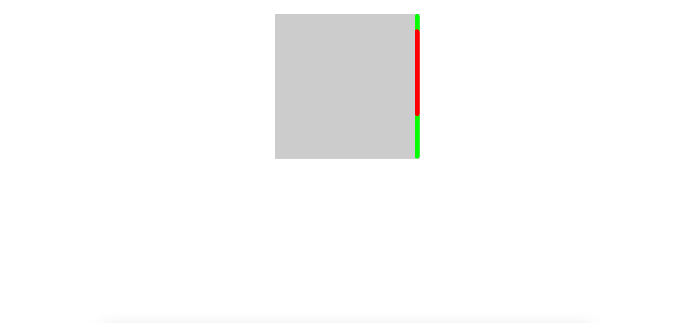

# react-mini-scrollbar

> A custom scrollbar component for React

[](https://www.npmjs.com/package/react-mini-scrollbar) [](https://standardjs.com)

## Install

```bash
yarn add react-mini-scrollbar
```

## Usage

```jsx
import React from 'react'
import 'react-mini-scrollbar/dist/index.css'
import { CustomScrollbar } from 'react-mini-scrollbar'

const App = () => {
  return (
    <div
      style={{
        position: 'relative',
        top: '2rem',
        margin: 'auto',
        height: '300px',
        width: '300px'
      }}
    >
      <CustomScrollbar
        right={1}
        thumbColor='#f00'
        trackColor='#0f0'
        thumbWidth={10}
        trackWidth={10}
        height={300}
        isShowTrack={true}
        className='custom-scrollbar'
      >
        <div
          style={{
            height: '500px',
            width: '100%',
            background: '#ccc'
          }}
        ></div>
      </CustomScrollbar>
    </div>
  )
}

export default App
```

Result:


## License

MIT © [henrynguyen6677](https://github.com/henrynguyen6677)
